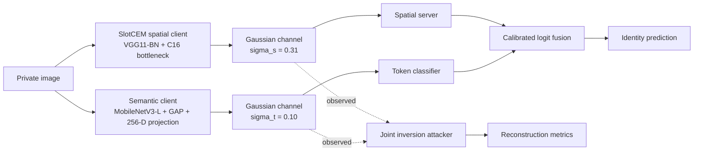
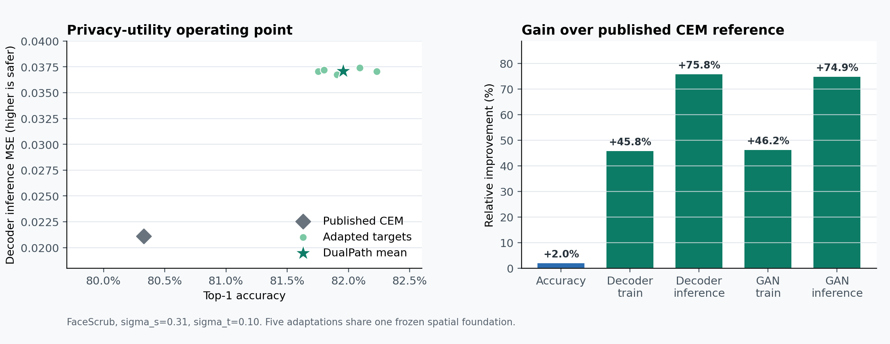

# DualPath-CEM Showcase

[](https://github.com/asher0913/DualPathCEM/actions/workflows/snapshot-checks.yml)
[](LICENSE)
[](SNAPSHOT.md)

A frozen public snapshot of a dual-path privacy-utility architecture for
collaborative face inference. This repository is intended for technical review,
portfolios, and interviews. Active journal experiments and collaboration remain
in a separate private repository.

## Quick start

```bash
git clone https://github.com/asher0913/DualPathCEM && cd DualPathCEM
python3 -m venv .venv && . .venv/bin/activate && pip install -e '.[dev]'
pytest -q && python scripts/verify_showcase.py
```

This needs Python 3.10+ and no GPU or dataset. The tests exercise the model, fusion and attack
code on random tensors. `verify_showcase.py` checks the frozen evidence: every headline metric,
the row count of each results table, the seeds and the exclusion policy. The `Snapshot checks`
workflow runs the same commands on every push. Training and the attacks themselves need FaceScrub
and a GPU (see Local checks).

## Why two paths?

A split model sends an intermediate representation from a trusted client to an
untrusted server. Strong perturbation can make this spatial representation
harder to invert, but it also removes information needed for recognition.
DualPath-CEM separates these responsibilities:

- **G-Path (spatial/privacy path):** a frozen SlotCEM client produces a
  `16 x 16 x 16` spatial tensor. Deployment noise `sigma_s = 0.31` protects the
  tensor before transmission.
- **S-Path (semantic/utility path):** MobileNetV3-Large, global average pooling,
  and a learned projection produce a 256-dimensional token. A separate noise
  channel uses `sigma_t = 0.10`.
- **Calibrated fusion:** the server combines the two classifiers with one
  learned global mixing coefficient and one learned temperature per path. It is
  not a sample-dependent gate.

The attacker is assumed to observe **both** released tensors. Decoder, GAN, and
adaptive joint attacks therefore receive the same information available to the
untrusted server.



The underlying SlotCEM regulariser is used while training the spatial
foundation; it does not transmit slot prototypes. See
[`docs/ARCHITECTURE.md`](docs/ARCHITECTURE.md) for tensor shapes, training
stages, and the threat model.

## Audited FaceScrub snapshot

The table reports means from the frozen evidence package. Higher accuracy is
better. For reconstruction attacks, higher MSE means less faithful recovery and
therefore stronger measured privacy.

| Method | Top-1 accuracy | Decoder MSE, train/inference | GAN MSE, train/inference |
|---|---:|---:|---:|
| Published Noise_ARL+CEM | 80.33% | 0.0182 / 0.0211 | 0.0212 / 0.0231 |
| **DualPath-CEM** | **81.96%** | **0.0265 / 0.0371** | **0.0310 / 0.0404** |

Against the published CEM reference values, this snapshot records:

- `+1.63` percentage points in top-1 accuracy;
- `+75.8%` decoder inference MSE;
- `+74.9%` GAN inference MSE;
- consistent means across five adaptation seeds (`126-130`).



The formal evidence contains 70 main attack runs, 15 repeated utility
evaluations, 96 supplementary attack runs, a matched-capacity control, and a
ResNet-18 control. Machine-readable tables are in [`results/`](results/).

### Where the accuracy comes from

Mean over the five adapted targets
([`results/formal_component_target_level.csv`](results/formal_component_target_level.csv)):

| Classifier | Top-1 accuracy |
|---|---:|
| Spatial path only (noisy SlotCEM tensor) | 58.69% |
| Semantic path only (256-D token) | 74.75% |
| Fused, before joint adaptation | 76.69% |
| **Fused, after adaptation (DualPath-CEM)** | **81.96%** (95% CI 81.80–82.12 across target seeds) |

Neither path is enough on its own. The noise that protects the spatial tensor costs it most of
its accuracy, and the token alone is 7 points short. Calibrated fusion plus joint adaptation
recovers the gap.

## Evidence and CI coverage

| Claim | Kind of evidence | File | Rerun in CI? |
|---|---|---|---|
| Accuracy and four attack MSEs, 5 target seeds × 3 attacker seeds | GPU experiments on real FaceScrub data | `results/formal_summary.json`, `formal_attack_runs.csv`, `formal_utility_repeats.csv` | **No:** training needs FaceScrub and a GPU. CI checks the frozen numbers, row counts and seeds with `verify_showcase.py`. |
| Component ablation above | same | `results/formal_component_target_level.csv` | Row count only |
| Matched-capacity and ResNet-18 controls, 96 supplementary attacks | same | `results/supplementary_summary.json`, `supplementary_attack_runs.csv` | Row count and capacity-match checks only |
| Model, fusion and attacker code paths | unit tests on random tensors | `tests/` | Yes |
| Published Noise_ARL+CEM row | copied from the CEM paper, not reproduced | `configs/` | n/a |

Reproducibility details:

- **Seeds:** target (adaptation) seeds 126–130; attacker seeds 10125, 20125 and 30125. Attacker
  runs are averaged within a target first, then intervals are taken across targets
  ([`results/README.md`](results/README.md)).
- **Data:** FaceScrub is not redistributed; [`DATA.md`](DATA.md) and
  [`results/data_manifest.json`](results/data_manifest.json) record the split, image counts and hash.
- **Environment:** [`environment/conda-linux-64.yml`](environment/conda-linux-64.yml) pins
  Python, PyTorch, torchvision and CUDA.

## Design trade-offs

| Decision | Chosen | Alternative | Why |
|---|---|---|---|
| Privacy vs utility | two released tensors with separate noise levels (σ = 0.31 spatial, 0.10 token) | one tensor with one noise level | One noise level has to serve both goals; separating them let the spatial path take heavy noise while the compact token carries recognition. |
| Fusion | one learned global mixing weight and a temperature per path | a sample-dependent gate | A global rule is easier to audit and cannot learn to route individual inputs around the privacy path. |
| Threat model | attacker sees both tensors | attacker sees only the spatial tensor | Anything weaker would overstate privacy, since the untrusted server receives both. |
| Spatial foundation | frozen SlotCEM client shared by all adaptations | retrain end to end per seed | This saves most of the GPU budget, but intervals then measure adaptation variance only (Evidence boundary). |

## Evidence boundary

These numbers are useful engineering evidence, but their scope matters:

- the reference row is taken from the published CEM paper rather than a new
  local reproduction;
- all five adaptations start from the same frozen SlotCEM spatial foundation,
  so they are not five independent end-to-end pretraining runs;
- the completed snapshot is FaceScrub-only;
- identity-conditioned joint attack and broader cross-dataset evaluation belong
  to the ongoing private study and are not claimed as completed here.

The public snapshot therefore demonstrates a strong measured operating point,
not a universal privacy guarantee or a completed journal submission.

## Repository map

| Path | Contents |
|---|---|
| `src/publication_cem/` | Dual-path model, fusion, semantic backbones, joint attacker, metrics, and reproducibility utilities. |
| `scripts/` | Stable target training, attack, evaluation, aggregation, and supplementary-control entry points. |
| `tests/` | Unit and protocol regression tests. |
| `results/` | Sanitised aggregate tables and per-run metrics. |
| `environment/` | Frozen Python, PyTorch, torchvision, and CUDA environment. |
| `configs/` | Published FaceScrub comparison thresholds used by the evaluation gate. |
| `third_party/` | Upstream licences and the minimal legacy VGG loader. |

## Inspect the code

The shortest path through the implementation is:

1. [`dual_path.py`](src/publication_cem/dual_path.py): model composition,
   Gaussian channels, calibrated fusion, and checkpoint loading.
2. [`semantic_backbones.py`](src/publication_cem/semantic_backbones.py):
   MobileNetV3 semantic encoder and 256-D projection.
3. [`dual_path_attack.py`](src/publication_cem/dual_path_attack.py): joint
   residual, GAN, and adaptive decoders.
4. [`train_dual_path_facescrub.py`](scripts/train_dual_path_facescrub.py):
   two-stage optimisation.
5. [`run_dual_path_publication_pipeline.py`](scripts/run_dual_path_publication_pipeline.py):
   restartable end-to-end campaign orchestration.

## Local checks

Python 3.10 or newer is required. The lightweight test suite does not require
FaceScrub or a GPU.

```bash
python -m venv .venv
source .venv/bin/activate
pip install -e '.[dev]'
pytest -q
python scripts/verify_showcase.py
```

The full experiment additionally requires FaceScrub, CUDA, evaluation extras,
and a compatible SlotCEM foundation checkpoint. Dataset images and checkpoints
are deliberately excluded from this public repository. The public
[`SlotCEM`](https://github.com/asher0913/SlotCEM) repository documents how the
spatial foundation is trained.

## Data and attribution

FaceScrub is not redistributed. [`DATA.md`](DATA.md) records the exact split
shape, image counts, hash, and output-class convention. Third-party code and
licences are documented in
[`THIRD_PARTY_NOTICES.md`](THIRD_PARTY_NOTICES.md).

